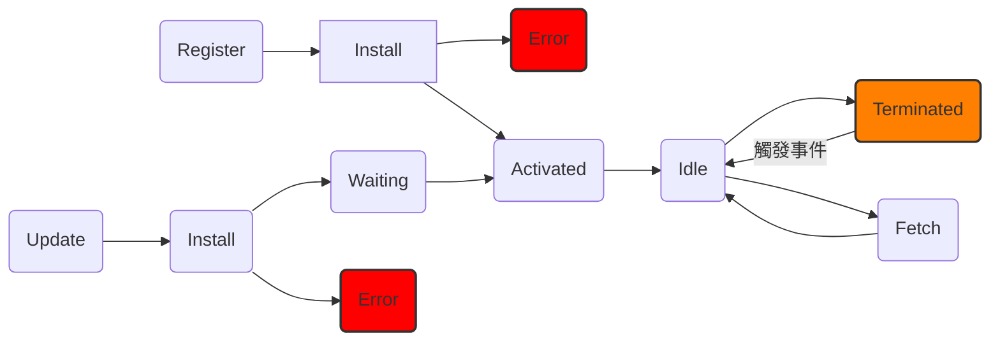

## 前言
* 客戶端快取（Client-side Cache）的主要目的是減少對伺服器的頻繁請求，進而提升使用者體驗與降低延遲時間。
* 當某些資料可以從本地快取中取得時，就無需再傳送網路請求，這不僅加快了回應速度，也減少了網路流量與伺服器的負擔。
## HTTP 快取控制與資料版本管理
### `Expires`、`Cache-Control`、`Last-Modified`、`ETag` 的差異

#### HTTP Header - Expires
##### 用途
* `Expires` 是 HTTP/1.0 中用來控制快取過期時間的標頭欄位。
* 用來控制該資源的快取有效時間，若在該時間內則可從快取中讀取資源。
* 若客戶端的系統時間超過設定時間，將會重新發送請求到伺服器端以獲取資源。
##### 範例
```html
HTTP/1.1 200 OK
Content-Type: image/png
Expires: Tue, 30 Jul 2025 15:00:00 GMT
```
* 若瀏覽器收到了上面的回覆，則代表該圖片在 2025/07/30 下午3點前都可以從快取讀出。
##### 問題
* 它是依照客戶端電腦的時間去做判斷的，若該電腦的時間故意調整成未來的年份，則每次都會重新發送請求來獲取資源。
#### HTTP Header - Cache-Control
##### 用途
* `Cache-Control` 是自 **HTTP/1.1** 起支援的快取控制標頭，用來定義資源在瀏覽器或中介快取中的保存策略。
* 其中 `max-age` 是常見參數，用來指定從接收資源當下起，多少秒內可直接使用快取資源，不須再次請求。
* 若`Cache-Control max-age`和`Expires`同時存在，則`Expires`會被`Cache-Control max-age`覆蓋。
##### 範例
```html
Cache-Control: public, max-age=86400
```
* 若客戶端都到以上回應，則代表該資源在一天內都可以從快取讀取。
* 當目前經過的時間超過一天，則會重新向伺服器端發出請求取得更新內容。
##### 相關指令
| 指令                   | 說明                                                     |
| -------------------- | ------------------------------------------------------ |
| **max-age**          | 設定資源的快取壽命（單位：秒）。過期後需重新驗證。                              |
| **s-maxage**         | 專用於共享快取（如 CDN 或 Proxy），若設置，會覆蓋 `max-age`。              |
| **no-cache**         | 可快取，但每次使用都需向伺服器確認資源是否更新（常搭配 `ETag` 或 `Last-Modified`）。 |
| **no-store**         | 嚴格禁止快取，不論是本地或代理端（常用於敏感資料，例如帳號頁面）。                      |
| **public**           | 可被任何快取裝置儲存（如瀏覽器、CDN、Proxy 等）。                          |
| **private**          | 僅允許該使用者的瀏覽器快取，不可由共享快取儲存。                               |
| **must-revalidate**  | 一旦資源過期，使用前必須向伺服器重新驗證，否則不能使用。                           |
| **proxy-revalidate** | 類似 `must-revalidate`，但僅適用於代理快取。                        |
| **immutable**        | 表示資源不會改變，快取期間瀏覽器不會檢查更新，即使使用者手動重新整理也不會請求。               |

#### HTTP Header - Last-Modified
##### 用途
* `Last-Modified` 是自 HTTP/1.0 起就支援的標頭。
* 當伺服器傳送資源給客戶端時，可附帶 `Last-Modified`，表示該資源在伺服器上最後修改的時間。
* 當客戶端重新發送請求時，會先發一個有包含`If-Modified-Since`標頭的請求，與伺服器確認該資源是否有被更新。 
##### 範例 
* 當使用者重新整理頁面時會發送發送以下HTTP Header的請求到伺服器端。
```html
If-Modified-Since: Wed, 26 Jun 2024 10:20:00 GMT
```
* 伺服器會去檢查該資源有無更新，若沒有則會回傳HTTP Status Code 304 Not Modified回來，並且使用快取裡面的資源。

* 若該資源在伺服器有做更新則會回傳HTTP Status Code 200 OK回來，並且更新資源與重新壓`Last-Modified`的時間。
```html
HTTP/1.1 200 OK
Content-Type: image/png
Last-Modified: Sat, 29 Jun 2025 08:00:00 GMT
```
##### 問題
* 判斷依據為伺服器上的「檔案修改時間」，並非實際內容是否變動。
- 即使內容未改變，只要檔案重新儲存過，也會被視為檔案有做更新，導致資源重新傳送。
#### HTTP Header - Etag
##### 用途
* `Etag` 是自 HTTP/1.1 起就支援的標頭。
* 它代表伺服器對資源產生的一個「版本識別字串」，通常基於資源的內容（如 Hash、版本號、修改時間等）產生。
* 當伺服器傳送資源給客戶端時可會附帶 `Etag`，表示該資源的當前版本。
* 當客戶端重新發送請求時，會先發一個有包含`If-None-Match`標頭的請求，與伺服器確認是否有該參數的檔案。 
##### 範例
*  客戶端首次向伺服器發出請求時會發送包含以下Header的請求。
```html
HTTP/1.1 200 OK
ETag: "v1-xyz"
```
* 當客戶端重新發送請求時，會先發送包含以下Header的請求。
```html
GET /style.css
If-None-Match: "v1-xyz"
```
* 伺服器會去檢查該資源有無更新，若沒有則會回傳HTTP Status Code 304 Not Modified回來，並且使用快取裡面的資源。

* 若該資源在伺服器有做更新則會回傳HTTP Status Code 200 OK回來，並且更新資源與重新壓`ETag`的參數。
```html
HTTP/1.1 200 OK
ETag: "v2-abc"
```
#### 統整

| 特性     | Cache-Control      | Expires                      | Last-Modified          | ETag                                 |
| ------ | ------------------ | ---------------------------- | ---------------------- | ------------------------------------ |
| HTTP版本 | HTTP/1.1           | HTTP/1.0 (已過時)               | HTTP/1.0 及更高版本         | HTTP/1.1                             |
| 目的     | 定義快取策略，控制快取的行為     | 設定資源的絕對過期時間                  | 基於時間戳記的資源版本驗證          | 基於內容雜湊的資源版本驗證                        |
| 優點     | 最靈活、功能強大，解決多種快取問題  | 簡單（但不推薦使用）                   | 簡單易用，節省頻寬              | 精確性高，解決 `Last-Modified` 的限制，處理多種版本問題 |
| 缺點     | 相對複雜，需要理解多個指令      | 依賴時鐘同步，靈活性差                  | 精度問題，無法處理內容變但時間不變等邊緣情況 | 伺服器生成和比較 `ETag` 可能有性能開銷              |
| 是否建議使用 | **優先使用**，提供全面的快取策略 | 不建議單獨使用，被 `Cache-Control` 取代 |                        |                                      |
### 「強制快取」與「協商快取」
#### 強制快取 
##### 意思
* 當快取過期會直接發送請求到伺服器端。
##### 範例
* Expries
```html
Expires: Wed, 03 Jul 2025 10:00:00 GMT
```
* Cache-Control
```html
Cache-Control: public, max-age=31536000, immutable
```
#### 協商快取 
##### 意思
* 每次重新整理網頁都會先向伺服器端詢問是否有更新資源，若沒有則回傳304，若有則會傳200並更新資源與重新壓時間/版本號。
##### 範例
* ETag
 * 伺服器回應：
 ```html
 ETag: "abc123" Cache-Control: no-cache
 ```
 * 瀏覽器下次請求時自動加上：
 ```html
 If-None-Match: "abc123"
 ```
* Last-Modified
  * 伺服器回應：
  ```html
  Last-Modified: Tue, 25 Jun 2025 09:00:00 GMT
  Cache-Control: no-cache
  ```
  * 瀏覽器下次請求時自動加上：
  ```html
  If-Modified-Since: Tue, 25 Jun 2025 09:00:00 GMT
  ```
### 資源版本管理策略（如 QueryString Hash、檔名 Hash）
#### Query String Hash
##### 範例
```html
<script src="~/lib/its/itsscript.js" asp-append-version="true"></script>
```
* 在ASP.NET Core後加入以下程式碼
```csharp
app.UseStaticFiles();
```
* 在瀏覽器裡面就可以看到以下的html
```html
<script src="/lib/its/itsscript.js?v=4NttebSY2x9_Ce6SvCtSg63oB0HMGBznApJPcat0bKI"></script>
```

* 如果沒有加上上面這些的參數，在瀏覽器裡面會看到以下的html
```html
<script src="/lib/its/itsscript.js"></script>
```
##### 注意事項
* asp-append-version是依照檔案內容去做hash的，也就是說檔案內容有做變更她後面的hash值就會不一樣。
* 在頁面上無法直觀的確定是否版本有做更新。
#### 檔名Hash
* 檔名Hash 通常是透過 Webpack、Vite 等工具來實做的。
* 以下範例是透過 Vite 來實作檔名Hash。
##### 範例
* 在 vite.config.ts 裡面有以下程式碼
```typescript
import { fileURLToPath, URL } from 'node:url'

import { defineConfig } from 'vite'
import vue from '@vitejs/plugin-vue'
import vueJsx from '@vitejs/plugin-vue-jsx'
import vueDevTools from 'vite-plugin-vue-devtools'

// https://vite.dev/config/
export default defineConfig({
  plugins: [vue(), vueJsx(), vueDevTools()],
  resolve: {
    alias: {
      '@': fileURLToPath(new URL('./src', import.meta.url)),
    },
  },
  build: {
    rollupOptions: {
      output: {
        entryFileNames: 'assets/[name].[hash].js',
        chunkFileNames: 'assets/[name].[hash].js',
        assetFileNames: 'assets/[name].[hash].[ext]',
      },
    },
  },
})
```
* 在command line 輸入以下指令
```shell
npm run build
```
* 就可以在Dict裡面的assets資料夾查看到以下檔名的檔案
```folder
dist/
├── assets/
│   ├── logo.8f4df6b5.svg
│   ├── main.1a2b3c4d.js
│   └── style.2f3e4d5b.css
└── index.html
```

## 瀏覽器快取
### cookie、localStorage、sessionStorage、IndedxedDB、Cache Storage API、OPFS

| 技術                               | 容量           | 生命週期       | 是否隨請求送出 | 使用場景          |
| -------------------------------- | ------------ | ---------- | ------- | ------------- |
| Cookie                           | 約 4KB        | 可設定過期時間    | 會       | 身份驗證、追蹤、會話管理  |
| localStorage                     | 約 5MB ~ 10MB | 永久         | 不會      | 長期資料儲存、用戶設定   |
| sessionStorage                   | 約 5MB ~ 10MB | 分頁關閉即失效    | 不會      | 臨時資料、分頁內狀態    |
| IndexedDB                        | 幾十MB ~ 幾百MB  | 永久         | 不會      | 複雜結構化資料、離線資料庫 |
| Cache Storage API                | 依系統          | 由開發者與瀏覽器控制 | 不會      | 靜態資源快取、離線瀏覽   |
| OPFS（Origin Private File System） | 依系統          | 由使用者決定     | 不會      | 大量檔案操作、檔案系統模擬 |
### Progressive Web App（PWA）與Service Worker
#### PWA
##### 特性
1. 可以直接透過瀏覽器安裝，不需要透過應用商店下載。
2. 基本上都是響應式設計（RWD），因為它的目的是要讓使用者在任何裝置上都能獲得良好的使用體驗。
3. 提供離線支持，當用戶第一次加載應用時，Service Worker 會將資料儲存到快取裡面，當離線時 Service Worker 會攔截網路請求將它導到快取裡。
4. 需要使用 HTTPS，這是為了實現 Service Worker 的安全性。
##### 使用方式
* 需要有mainfest.json的檔案。
 ```json
 {
  "name": "我的購物應用程式",
  "short_name": "購物App",
  "start_url": "/index.html",
  "display": "standalone",
  "background_color": "#ffffff",
  "theme_color": "#000000",
  "icons": [
    {
      "src": "/images/icons/icon-72x72.png",
      "sizes": "72x72",
      "type": "image/png"
    }
    ]
 }
 ```
* 在mainfest.json裡面start_url指令的html加入以下程式。
 ```html
 <link rel="manifest" href="/manifest.json">
 ```
* 當使用者進入index.html的網頁時，就可以安裝PWA的應用程式。
#### Service Worker
##### 生命週期


1. Register(註冊)
	- 在瀏覽器支援的情況下註冊 `/sw.js`。
	- 通常於網頁載入後觸發（`window.load`），避免太早註冊導致資源尚未就緒。
 ```js
  if ('serviceWorker' in navigator) {
  window.addEventListener('load', () => {
    navigator.serviceWorker.register('/sw.js')
      .then((registration) => {
        console.log('[SW] Registered:', registration);
      })
      .catch((error) => {
        console.error('[SW] Registration failed:', error);
      });
  });
 }
 ```
2. Install(安裝)
	*  建立快取空間
	- 把指定資源加入快取中（預先快取）
 ```js
 self.addEventListener('install', (event) => {
  console.log('[SW] Install');
  event.waitUntil(
    caches.open(CACHE_NAME).then((cache) => {
      return cache.addAll(STATIC_ASSETS);
    })
  );
  self.skipWaiting();
 });
 ```
3. Actiated(啟用)
	- 清理所有非目前版本的快取（舊版資源）。
	- 確保 activate 階段直到清理完成後才結束。
	- 立即控制目前所有頁面（不等使用者重新整理）。
 ```js
 self.addEventListener('activate', (event) => {
  console.log('[SW] Activate');
  event.waitUntil(
    caches.keys().then((keys) =>
      Promise.all(keys.map((key) => {
        if (key !== CACHE_NAME && key !== API_CACHE_NAME) {
          return caches.delete(key);
        }
      }))
    )
  );
  self.clients.claim();
 });
 ```
4. Fetch
 - 當使用者在有註冊 Service Worker 的頁面發出請求時，會有以下三個步驟：
	 1. 先依據請求到快取裡面尋找，若在快取裡面有則直接返回該資源。
	 2. 若在快取裡面沒有則會發送網路請求到伺服器端。
	 3. 如果網路請求也失敗了，則會回傳一個離線頁面。
 ```js
 self.addEventListener('fetch', (event) => {
  const url = new URL(event.request.url);
  if (url.pathname.startsWith('/api')) {
    event.respondWith(
      fetch(event.request)
        .then((response) => {
          // 成功拿到網路資料就放進快取
          const resClone = response.clone();
          caches.open('api-cache').then(cache => cache.put(event.request, resClone));
          return response;
        })
        .catch(() => {
          // 網路失敗就用快取回應
          return caches.match(event.request);
        })
    );
  } else {
    // 一般靜態資源
    event.respondWith(
      caches.match(event.request).then((cachedRes) => {
        return cachedRes || fetch(event.request);
      }).catch(() => {
        return new Response('Offline', { status: 503 });
      })
    );
  }
 });
 ```
### 使用 Service Worker 快取 API 回應與離線資源

### 處理快取更新策略（cache-first、network-first、stale-while-revalidate）
#### cache-first
* cache 裡面資料存在
	* 直接將資料從 cache 裡面返回。
* cache 裡面資料不存在
	* 發送網路請求到伺服器端，取得回覆後將資料返回，並且將資料寫入 cache。
#### network-first
* 直接發送網路請求到伺服器端。
	* 網路請求成功
		* 將資料返回到客戶端。
		* 將資料寫入到 cache 裡面。
	* 網路請求失敗
		* 檢查 cache 裡面是否有對應的資料
			* 若有則將資料返回客戶端。
			* 若無則顯示錯誤或離線畫面。
#### stale-while-revalidate
* cache 裡面資料存在
	* 直接將資料從 cache 裡面返回。
	* 發送網路請求到伺服器端，取得回覆後將 cache 裡面的資料更新。
* cache 裡面資料不存在
	* 發送網路請求到伺服器端，取得回覆後將資料返回，並且將資料寫入 cache。
## 參考資料

[循序漸進理解 HTTP Cache 機制 | TechBridge 技術共筆部落格](https://blog.techbridge.cc/2017/06/17/cache-introduction/?source=post_page-----6d9d4cfe3291---------------------------------------)
[PWA 與 Service Worker簡介](https://ithelp.ithome.com.tw/users/20117813/ironman/2219)
[Service Worker詳細介紹](https://mp.weixin.qq.com/s/3Ep5pJULvP7WHJvVJNDV-g)

#cache #ServiceWorker #PWA