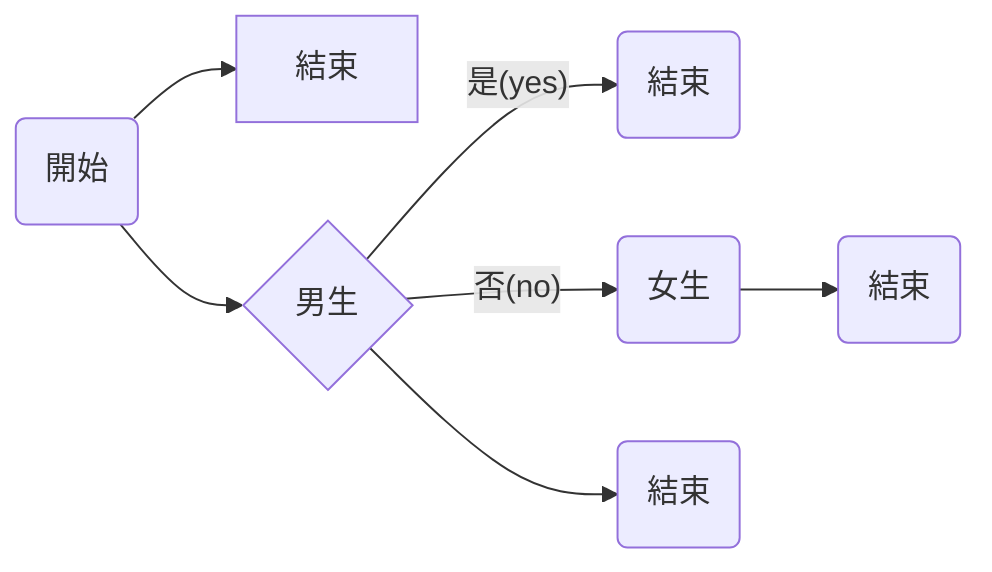
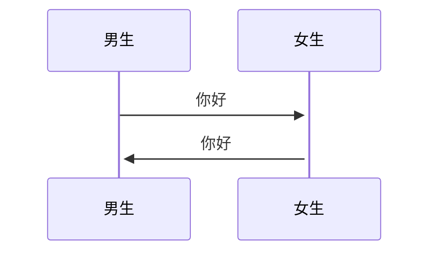
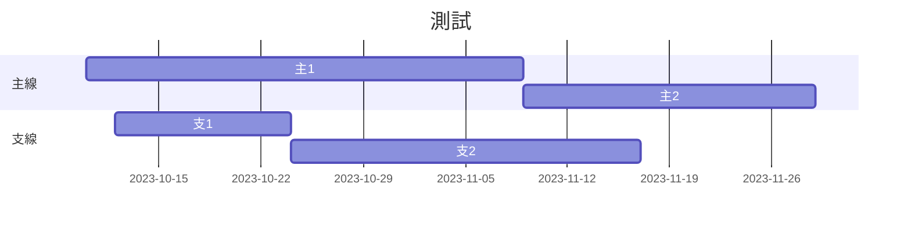

## 流程圖

* 流程圖方向：
	* TB ：上到下
	* LR ：左到右
	* BT ：下到上
	* RL ：右到左

```mermaid
  flowchart LR
      A("開始") --> B["結束"]
      A --> C{"男生"}
      C -->|"是(yes)"| D("結束")
	  C --> |"否(no)"| B1("女生") --> F("結束")
	  C --> E("結束")
```
## 序列圖

```mermaid
sequenceDiagram
男生 ->>+ 女生:你好
女生 ->>+ 男生:你好
```

## 甘特圖

```mermaid
gantt
    title 測試
    dateFormat  YYYY-MM-DD
    section 主線
    主1           :a1, 2023-10-10, 30d
    主2           :after a1  , 20d
    section 支線
    支1    :2023-10-12  , 12d
    支2      : 24d
```
## 參考資料
https://coffeetea.top/zh/markdown/mermaid.html
https://hackmd.io/@showsun/mermaid

#流程圖 #mermaid